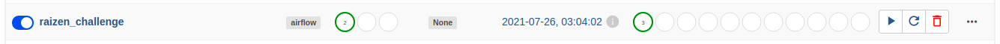
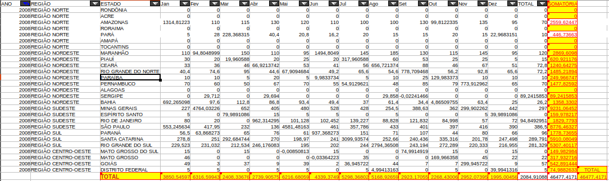
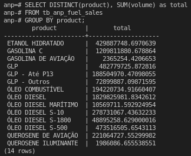

# Raizen Challenge

For the first execution, go to docker-compose folder and:

```docker-compose up airflow-init```

Then:

```docker-compose up```

Airflow UI can be accessed at http://localhost:8080/

To enter in postgresdb

```
docker exec -it <postgres_container_name> /bin/bash
psql -h localhost -p 5432 -U airflow -W
password: airflow 
```

If database doesn't exist, then:

```CREATE DATABASE anp;```

Enter inside Database:

```\c anp```

## Creating Airflow connection

At AirflowUI: Admin > Connections

* Conn Id: postgres_conn
* Conn Type: postgres
* Host: postgres
* Schema: anp
* Login: airflow 
* Password: airflow
* Port: 5432

## Running Dag

At AirflowUI in Dags page:

Turn on the dag *raizen_challenge* and Trigger DAG



## About the dataset

The dataset shows inconsistency in the total per year. The image below shows the difference of total from the table column "Total" and the column "SOMATORIA" that the result is correct.



In this scene, I consider sum manually 3 products and use the value to test. 

* 'ETANOL HIDRATADO' = 429887748.697065, 
* 'GLP' = 482779725.872813, 
* 'GASOLINA C' = 1209811880,678870

Note: The test doesn't cover all products.

The total per product is presented in the image below.



## Index

The columns *year_month* and *product* were selected to be indexed.